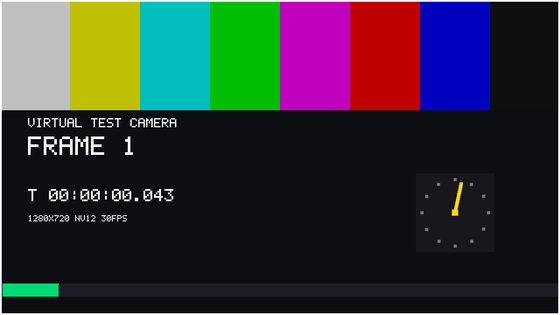

# VCamBench

**Windows 11에 가짜 카메라를 원하는 개수만큼 만들어 주는 도구.**

카메라를 다루는 소프트웨어는 장치가 0개일 때, 1개일 때, 2개 이상일 때 서로 다른 길을
탑니다. 문제는 그 상황을 실제로 만들어야 테스트가 된다는 것 — 웹캠을 뽑았다 꽂거나,
카메라 없는 노트북을 따로 구하거나, 카메라 세 대짜리 환경을 억지로 꾸며야 합니다.

이 도구는 그 환경을 소프트웨어만으로 만듭니다. 켜면 카메라가 생기고 끄면 사라집니다.



---

## 실제로 잡아낸 문제

만든 당일, 이 도구로 사내 제품의 실제 결함을 찾았습니다.

> Windows 뷰어에서 장치설정의 카메라를 바꿔도 미리보기가 이전 카메라를 계속 보여줬다.
> 원인은 WebRTC 라이브러리가 카메라 **목록**을 만들 때는 128바이트 버퍼로, 카메라를
> **찾을** 때는 256바이트 버퍼로 같은 장치 ID를 읽고 있던 것. ID가 127바이트를 넘는
> 카메라는 두 값이 달라 매칭에 실패하고, 조용히 0번 카메라로 폴백했다.
>
> USB 웹캠은 ID가 95바이트라 우연히 잘 동작했다. **이 가상 카메라(161바이트)를 꽂자
> 비로소 드러났다.**

도구가 없었으면 계속 묻혀 있었을 결함입니다.

---

## 요구사항

- **Windows 11** (빌드 22000 이상) — `MFCreateVirtualCamera`가 Windows 11 전용입니다
- 설치 시 관리자 권한 (미디어 소스를 `HKLM`에 COM 등록해야 합니다)

Windows 10에서는 동작하지 않습니다. 설치 프로그램이 거부합니다.

## 설치

**Microsoft Store** *(준비 중 — 링크는 게시 후 추가)*
설치와 업데이트가 자동으로 처리됩니다.

**직접 내려받기** — [Releases](../../releases)에서 최신 `setup.exe`

> **서명 전 안내** — 아직 코드 서명이 없어 SmartScreen 경고가 뜹니다.
> `추가 정보` → `실행`으로 넘기시면 됩니다. 무료 코드 서명을 신청 중입니다.

**직접 빌드** — 소스가 MIT로 공개되어 있으니 아래 [빌드](#빌드) 절차대로 직접 만들어
쓰셔도 됩니다. 스토어판과 같은 코드입니다.

## 사용

1. 앱을 실행하고 **추가**를 원하는 만큼 누릅니다
2. 카메라 앱, Chrome, Zoom, Teams 등에서 목록에 나타납니다
3. **창을 닫으면 카메라가 사라집니다** — 프로세스가 살아 있는 동안만 존재합니다

각 카메라는 화면에 자기 이름과 프레임 카운터, 경과 시간, 회전 다이얼을 그립니다.
정지 화면인지 살아 있는 스트림인지 눈으로 즉시 구분할 수 있습니다.

### 같이 설치되는 진단 도구

```powershell
# Windows가 실제로 무엇을 열거하는지 - MF / DirectShow / WinRT 경로별로
camlist.exe --all

# 일반 앱과 같은 경로로 프레임을 받아 BMP 저장 - 영상 전달 증명
camcapture.exe --name "VCamBench 1" --frames 5 --out .\frames

# 콘솔에서 카메라 관리 (스크립트용)
vcamctl.exe --count 3 --seconds 60
```

---

## 어떻게 동작하는가

Windows 11의 모든 카메라 접근은 **Windows Camera Frame Server**를 통과합니다.
이 앱은 프레임을 쏘는 게 아니라 **프레임 만드는 방법(COM 클래스)을 등록**합니다.
소비 앱이 카메라를 열면 Frame Server가 그 클래스를 자기 프로세스에 로드해 프레임을
당겨갑니다.

```
앱  "이 CLSID로 카메라 만들어줘"  ──▶  Frame Server (svchost.exe)
     (영상 경로에 없음)                  │ 우리 DLL 을 로드
                                        ▼ 33ms 마다 프레임 생성
                                카메라 앱 / Chrome / Zoom / Teams …
```

그래서 **MSIX로는 배포할 수 없습니다.** MSIX는 사용자 단위로 등록되는데 Frame Server는
LOCAL SERVICE 계정으로 돌아서 그 등록을 보지 못합니다. 실험과 근거는
[`docs/msix-limitation.md`](docs/msix-limitation.md)에 정리했습니다.

## 검증된 범위 (Windows 11 26200)

| 항목 | 결과 |
|---|---|
| 카메라 목록 노출 | Media Foundation / DirectShow / WinRT 세 경로 모두 |
| 영상 전달 | 1280×720 NV12 30fps, 변환 없이 |
| 확인한 소비 앱 | Windows 카메라 앱, Chrome, 사내 WebRTC 뷰어 |
| 동시 다중 카메라 | 실물 1 + 가상 3 = 4대 |
| 호스트 종료 시 | 목록에서 제거 (강제 종료해도 잔존물 없음) |

---

## 빌드

- Visual Studio 2022 (C++ 데스크톱 워크로드)
- Windows SDK 10.0.22621 이상
- 설치 프로그램을 만들려면 Inno Setup 6

```powershell
cmake -S . -B build -G "Visual Studio 17 2022" -A x64
cmake --build build --config Release
.\build\Release\vcamcore_tests.exe

& "${env:ProgramFiles(x86)}\Inno Setup 6\ISCC.exe" installer\vcambench.iss
```

개발 중 DLL을 고칠 때는 Frame Server가 옛 이미지를 캐시합니다. `tools\`의 스크립트가
그 상황을 정리해 줍니다 — 이유는 각 스크립트 주석에 있습니다.

## 라이선스

MIT — [`LICENSE`](LICENSE)

## 후원

이 도구는 MIT로 공개되어 있고 누구나 직접 빌드해 무료로 쓸 수 있습니다.
Microsoft Store 판매는 **편의에 대한 비용**입니다 — 서명된 설치 파일, 빌드 환경 불필요,
자동 업데이트.

직접 빌드해서 쓰시는 분 중 도움이 됐다면
[GitHub Sponsors](https://github.com/sponsors/<GITHUB-USERNAME>)로 후원해 주세요.
